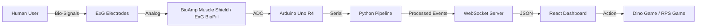

# NeuroTECH - A BCI Project
## Full System Documentation

Welcome to the comprehensive documentation for **NeuroTECH**, a cutting-edge Brain-Computer Interface (BCI) system designed for real-time biosignal acquisition, processing, and application control.

---

## 1. System Overview

NeuroTECH is a modular BCI platform that enables human-to-computer communication using physiological signals. The current implementation focuses on **Electrooculography (EOG)** for eye blink detection (controlling a Dino Game) and **Electromyography (EMG)** for muscle activity recognition (controlling a Rock-Paper-Scissors game).

### 1.1 High-Level Architecture

---

## 2. Hardware Specification

The hardware layer is responsible for capturing micro-voltage potentials from the skin and converting them into digital data.

### 2.1 Core Components
-   **Microcontroller**: [Arduino Uno R4](https://store.arduino.cc/products/unor4-wifi)
    -   High-speed 32-bit RA4M1 microprocessor.
    -   14-bit ADC resolution (configured to 12-bit or 14-bit).
-   **EMG/EOG Shield**: [Muscle BioAmp Shield v0.3](https://github.com/upsidedownlabs/DIY-Muscle-BioAmp-Shield)
    -   **Design**: DIY Electrophysiology shield inspired by the Backyard Brains Muscle Spiker Shield.
    -   **Amplification**: Quad Op-Amp based differential amplifier (LM324) with high input impedance.
    -   **Feedback Interface**: 
        -   6-LED Bar Graph (Pins 8-13) for visual signal strength.
        -   Audio output (3.5mm jack) for listening to muscle "clicks".
        -   User Buttons: SW1 (Pin 4), SW2 (Pin 7) for event triggers.
    -   **Expansion Ports**:
        -   STEMMA I2C Port (SDA/SCL): For OLED or sensors.
        -   STEMMA Analog Port (A1): For connecting a second **BioAmp ExG Pill**.
        -   STEMMA Digital Port: For external actuators.
-   **ExG Sensor**: [BioAmp ExG Pill](https://github.com/upsidedownlabs/BioAmp-EXG-Pill)
    -   A small, integrated analog front-end for ECG, EMG, EOG, and EEG.
    -   Connects via JST-PH or STEMMA analog port to expand channel counts.

### 2.2 Pin Mapping & Acquisition
| Component | Pin | Function |
| :--- | :--- | :--- |
| **Signal Ch0** | `A0` | Primary Bio-Potential Input |
| **Signal Ch1** | `A2` | Secondary/Reference Input |
| **LED Bar** | `8-13` | Signal Intensity Visualization |
| **Switch 1** | `D4` | User Event Trigger 1 |
| **Switch 2** | `D7` | User Event Trigger 2 |
| **Servo Out** | `D5, D6`| PWM Control based on signals |

-   **Sampling Rate**: 512 Hz (configured via `FspTimer` on Uno R4).
-   **Baud Rate**: 230,400 bps.
-   **Resolution**: 14-bit ADC (RA4M1 native).

---

## 3. Software Pipeline (Backend)

The backend is built in Python and manages the flow of data from the hardware to the application.

### 3.1 Data Acquisition (`src.acquisition`)
-   **Serial Reader**: `SerialPacketReader` handles robust multi-threaded reading from the COM port, syncing on the binary headers and handling mixed text/binary data.
-   **LSL Streaming**: Data is pushed to the [Lab Streaming Layer (LSL)](https://github.com/sccn/labstreaminglayer) for high-performance, low-latency distribution.
    -   `BioSignal-Raw-uV`: Unfiltered microvolt data.
    -   `BioSignals-Events`: Control events (button presses).

### 3.2 Signal Processing (`src.processing`)
Signals are cleaned in real-time using the `EOGFilterProcessor`:
1.  **High-Pass Filter (0.5Hz)**: Removes DC drift and motion artifacts.
2.  **Low-Pass Filter (10-400Hz)**: Removes high-frequency muscle noise or electronic interference.
3.  **Notch Filter (50Hz/60Hz)**: Eliminates power line hum.
4.  **Result**: Pushed to the `BioSignal-Processed` LSL stream.

---

## 4. Feature Extraction & Detection

NeuroTECH uses both rule-based and Machine Learning approaches to interpret signals.

### 4.1 EOG (Eye Blinks)
-   **Extractor**: `BlinkExtractor` uses a sliding window to find amplitude spikes above a threshold.
-   **Detector**: `BlinkDetector` classifies spikes into `SingleBlink` or `DoubleBlink` based on duration and peak count.
-   **ML Alternative**: `EOGMLDetector` uses a pre-trained **Random Forest** model to classify complex eye gestures with higher accuracy.

### 4.2 EMG (Rock-Paper-Scissors)
-   **Extractor**: `RPSExtractor` calculates 13 time-domain features (RMS, MAV, Variance, etc.) over a 1-second sliding window.
-   **Model**: A Random Forest classifier (trained via `src.learning.eog_trainer.py`) maps features to `Rock`, `Paper`, or `Scissors`.

---

## 5. Frontend & Application Layer

The frontend is a **React** application that provides a dashboard for visualization and games for interaction.

### 5.1 Dashboard Views
-   **Live Dashboard**: Real-time signal graphing using Highcharts/Chart.js.
-   **Dino Game**: A BCI-controlled runner game. Blinks trigger jumps.
-   **RPS Game**: A gesture-controlled game using muscle signals.
-   **Calibration**: Tools for setting ADC baselines and training ML models.

### 5.2 Communication
-   **WebSockets**: The `Web Server` component publishes events from the pipeline to the React frontend in real-time JSON format.

---

## 6. Setup & Operational Guide

### 6.1 Prerequisites
-   Python 3.10+
-   Node.js & npm
-   Arduino IDE (for firmware uploading)

### 6.2 Installation
1.  **Clone the Repo**: `git clone ...`
2.  **Hardware Setup**: Connect electrodes to the BioAmp Shield and stack it on the Uno R4.
3.  **Flash Firmware**: Upload `firmware/Uno_R4_2ch_512Hz/Uno_R4_2ch_512Hz.ino` to the Arduino.
4.  **Install Python Deps**: `pip install -r requirements.txt`
5.  **Install Frontend Deps**: `cd frontend && npm install`

### 6.3 Running the System
-   **Production**: Run `pipeline.py` to start the full stack.
-   **Development**: Run `pipeline.py --dev` to start the Vite dev server alongside the backend.

---

*NeuroTECH - Bridging the gap between the brain and the machine. | 2026*
